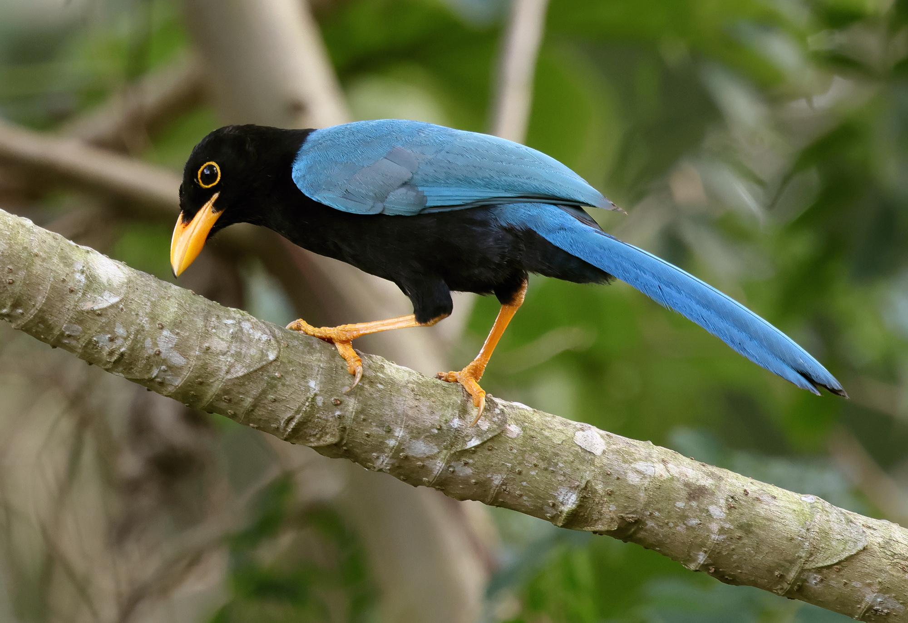

## Macroevolutionary-Drivers-of-Passerine-Diversity-
This repository contains all data, workflows, scripts, and source code required to reproduce the analyses and results presented in the manuscript Macroevolutionary Drivers of Passerine Community Assembly in a Neotropical Peninsular System, currently under revision at the [*Journal of Biogeography*](https://onlinelibrary.wiley.com/journal/13652699).

 \
**Cyanocorax yucatanicus** is an endemic species from the Yucatán Peninsula. Photo from [enciclovida, CONABIO](https://enciclovida.mx/especies/35985).

**Background** \
Neotropical systems harbor an exceptionally high diversity of birds; however, the macroevolutionary processes shaping avian communities across most regions remain poorly understood, and the relative contributions of different processes are often difficult to disentangle. The theory of island biogeography predicts that species richness in geographically isolated communities is determined primarily by the balance between immigration and extinction [MacArthur and Wilson, 1967](https://www.jstor.org/stable/j.ctt19cc1t2). However, the classic equilibrium theory has been challenged by evidence suggesting that speciation and the geological dynamics of island systems can also play major roles in generating biodiversity. Here, we used [DAISIE](https://rsetienne.github.io/DAISIE/) model of island biogeography to infer the timing and mechanisms of passerine community assembly in the Yucatán Peninsula, Mexico.

**/data:** \
Contain files to assembling and annotated cpDNA from row data sequences. \

**/bin:** \
Contain files to assembling and annotated cpDNA from row data sequences. \

***1_reads_preprocessing_and_assembly.txt***: Runs a workflow consisting of five main steps for chloroplast genome assembly: (1) setting environment variables and creating output directories and paths; (2) downloading and assessing sequencing data published by [Breslinn et al., (2021)](https://onlinelibrary.wiley.com/doi/10.1002/tax.12451) and [Chincoya et al (2023)](https://pubmed.ncbi.nlm.nih.gov/37106713/); (3) preprocessing and trimming reads using [TrimGalore](https://github.com/FelixKrueger/TrimGalore) version 0.4.3; (4) assembling chloroplast genomes with [GetOrganelle](https://github.com/Kinggerm/GetOrganelle) version 1.7.1; and (5) evaluating assembly quality using [Bandage](https://github.com/rrwick/Bandage#2022-update). \
***2_genome_assembly_various_values.txt***: This script executes steps 4 and 5 of the previous loop, but testing multiple w values (33, 35, 40, ..., 105, and 110) with [GetOrganelle](https://github.com/Kinggerm/GetOrganelle) version 1.7.1 during chloroplast genome assembly and evaluating assembly completeness and circularization with [Bandage](https://github.com/rrwick/Bandage#2022-update). \
***3_pga_annotation.txt***: We employed two annotators: 1) [GeSeq](https://chlorobox.mpimp-golm.mpg.de/geseq.html) from Chlorobox and 2) [PGA](https://github.com/quxiaojian/PGA), which works through the command line. The present loop is used to extract FASTA files from assembled genomes and annotate them. \
**/metadata:** \
Contains a CSV file listing the GenBank accession numbers of the raw sequencing data used for all analyzed species. \
**/scripts:** \
Contains a Python script for comparing nucleotide sequence identity, length, and gene annotation between the two inverted repeat (IR) regions. \
**/chloroplast_genomes** \
This directory contains annotated chloroplast genome maps in PNG format (.png). \
**/references** \
This directory contains annotated chloroplast genome maps in genebank and fasta formats dowloaded from genebank. \
**gb files** \
GenBank format files (.gb) are available upon request from the corresponding author.

**References** \
MacArthur RH, Wilson EO (1967) The theory of island biogeography. Princeton University Press.
Valente, L, Phillimore, AB, Etienne, RS (2015) Equilibrium and non-equilibrium dynamics simultaneously operate in the Galápagos islands. Ecology Letters 18: 844-852. https://doi.org/10.1111/ele.12461.
